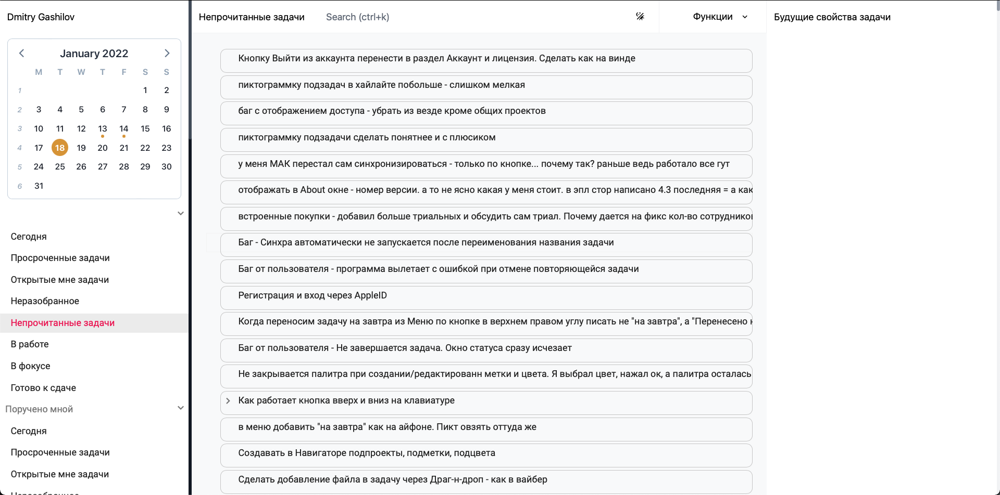

# [Leadertask Web v2.0](https://app.leadertask.ru)

[](https://app.leadertask.ru)

**Leadertask Web 2.0** next version of existing leadertask web.

### Installation

1. Clone the repo (Vue3 project)
   ```sh
      git clone https://github.com/LeaderTask/Web.git
    ```
2. Install NPM packages
    ```sh
        npm install
    ```
3. Run the development server 
    ```sh
        npm run serve 
    ```
